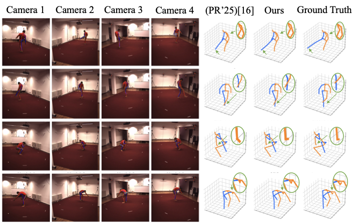
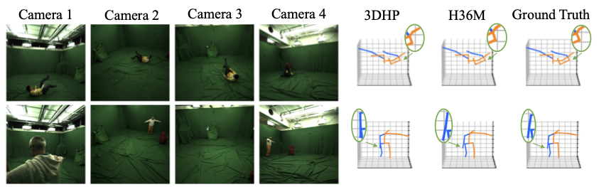
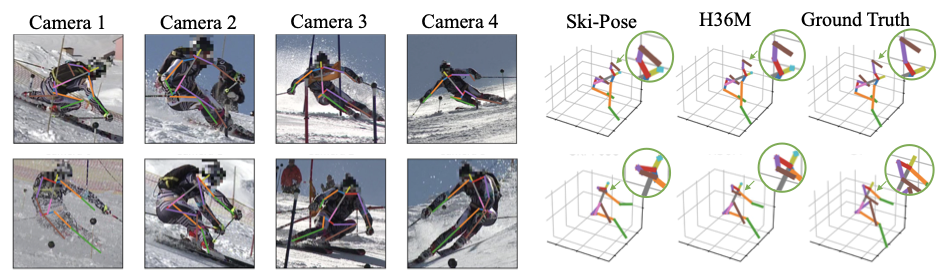

# DSVTformer: Dual-stream Spatial-View-Temporal Transformer for Multi-view 3D Human Pose Estimation

DSVTformer is a multi-view 3D human pose estimation framework that integrates **2D pose features** and **per-view image context features** using a **dual-stream transformer architecture**.
The model explicitly decomposes and models **Spatial-View-Temporal (SVT)** correlations via axis-aware attention blocks, enabling robust 3D pose estimation **without requiring camera parameters**.

*This repository provides an open-source implementation accompanying a manuscript currently under review. 
Detailed descriptions and experimental results may be updated as the review process progresses.*


## Highlights

- **Dual-stream formulation**: jointly leverages 2D keypoints and image context features, improving robustness to noisy or degraded 2D detections.
- **Axis-aware SVT decomposition**: sequential modeling of spatial, view, and temporal correlations through dedicated dual-stream fusion blocks.
- **Calibration-free**: no camera intrinsics or extrinsics are required during training or inference.
- **Stable performance** across different 2D pose detectors on Human3.6M.

## Method Overview

DSVTformer consists of two stages:

1. **Feature Extraction**
   For each frame and camera view, a pre-trained **YOLOv3** detector is used to localize the human bounding box, followed by cropping and resizing to a fixed resolution.
   A pre-trained **CPN** network is then used as a **frozen feature extractor** to obtain:
   - 2D joint coordinates
   - Per-view image context features

   The heatmap prediction head is removed, and only backbone features are retained.

2. **Dual-stream SVT Decoder**
   Multiple stacked decoder layers (default **L = 2**) are employed.
   Each layer performs:
   - Self-modal enhancement within pose and image streams
   - Bidirectional cross-modal interaction (Image-to-Pose and Pose-to-Image)
   - Axis-specific modeling across spatial, view, and temporal dimensions

## Requirements

- Python **3.8.19**
- PyTorch **1.8.0+cu111** 
- numpy
- tqdm
- fvcore
- pytz
- opencv-python

## Dataset: Human3.6M

This repository supports experiments on **Human3.6M** following the **standard evaluation protocol**.

### Splits and Metrics

- **Training subjects**: S1, S5, S6, S7, S8
- **Testing subjects**: S9, S11
- **Evaluation metrics**:
  - MPJPE (Protocol P1)
  - PA-MPJPE (Protocol P2)

## Qualitative Results

We visualize our reconstruction quality across three benchmarks. The following figures show representative results from our method on each dataset.

### Human3.6M



### 3DHP



### SkiPose



## Training / Evaluation

### Default Training Command (Human3.6M)

```bash
python main_img.py \
  --frames 27 \
  --batch_size 64 \
  --nepoch 50 \
  --lr 0.0002 \
  --model dsvtformer \
  --depth 2 \
  --gpu 0 \
  --embed_dim_ratio 32 \
  --img_embed_dim_ratio 16
```

### Evaluation Only

To run evaluation without training, add the `--test` flag:

```bash
python main_img.py --test
```


## Notes on Reproducibility

- Optimizer: Adam
- Initial learning rate: 0.0002
- Learning rate decay: 0.98 per epoch
- Training epochs: 50
- Default configuration: 2 decoder layers, 4 camera views, 27-frame temporal window
- Loss function: L2 loss
- Camera parameters: not used

## License

Please refer to the `LICENSE` file in the repository root.
